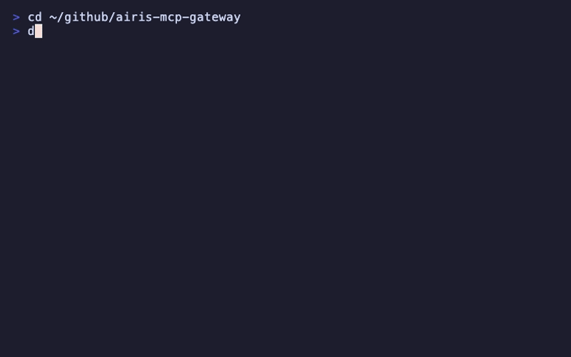

# AIRIS MCP Gateway

<p align="center">
  
</p>

One command to add 34+ AI tools to Claude Code. No config, no setup, just works.

## Quick Start

### Prerequisites

- Docker (Docker Desktop or OrbStack)

### Install

```bash
git clone https://github.com/agiletec-inc/airis-mcp-gateway.git
cd airis-mcp-gateway
docker compose up -d
```

### Register with Claude Code

```bash
claude mcp add --scope user --transport sse airis-mcp-gateway http://localhost:9400/sse
```

Done! You now have access to 34+ tools.

## Default Servers

| Server | Tools | Description |
|--------|-------|-------------|
| **airis-agent** | 10 | Confidence check, deep research, repo indexing |
| **mindbase** | 13 | Semantic memory with pgvector embeddings |
| **memory** | 9 | Knowledge graph for conversation context |
| **time** | 2 | Current time and timezone conversion |

## Configuration

### Enable/Disable Servers

Edit `docker-compose.yml`:

```yaml
command:
  - --servers=time
  - --servers=memory
  - --servers=airis-agent
  - --servers=mindbase
  # Add more servers:
  # - --servers=stripe
```

Then restart:

```bash
docker compose restart
```

### Add Custom Catalog

Create your own catalog file and mount it:

```yaml
command:
  - --additional-catalog=/workspace/my-catalog.yaml
```

## Commands

```bash
docker compose up -d          # Start
docker compose down           # Stop
docker compose restart        # Restart
docker compose logs -f        # View logs
docker compose pull && docker compose up -d  # Update
```

## Architecture

```
Claude Code / Cursor / Zed
    │
    ▼ SSE (http://localhost:9400/sse)
┌─────────────────────────────────┐
│  Docker MCP Gateway             │
│  (docker/mcp-gateway:latest)    │
├─────────────────────────────────┤
│  ├─ airis-agent (ghcr.io)       │
│  ├─ mindbase (ghcr.io)          │
│  ├─ memory (mcp/memory)         │
│  └─ time (mcp/time)             │
└─────────────────────────────────┘
```

## Related Projects

| Project | Description |
|---------|-------------|
| [airis-agent](https://github.com/agiletec-inc/airis-agent) | Intelligence layer - confidence checks, deep research |
| [mindbase](https://github.com/agiletec-inc/mindbase) | Cross-session semantic memory |

## Troubleshooting

### Check Status

```bash
docker compose ps
docker compose logs --tail 50
curl http://localhost:9400/health
```

### Reset

```bash
docker compose down -v
docker compose up -d
```

## License

MIT
